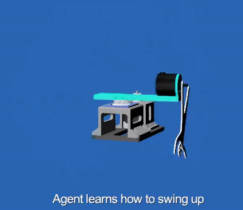

# Rotary Inverted Pendulum
Rotary Inverted Pendulum is a classical problem in the field of control systems. 
In this project we train a reinforcement learning agent to swing up an inverted pendulum and keep it in an upward position


## Requirements
### Q table approach
- Votex Studio 2020b
- numpy
- matplotlib
- Python 3.8 
### Deep reinforcement learning approach
- Votex Studio 2020b
- numpy
- matplotlib
- Python 3.8
#### How to set up Python and required packages
- Install python 3.8 64 bit in its default location
```
https://www.python.org/ftp/python/3.8.6/python-3.8.6-amd64.exe
```

- Install virtual environment: 
```
c:\python38\python -m pip install virtualenv
```

- Create a virtual environment in the project folder:
```
c:\python38\python -m virtualenv ml
```

- Activate the virtual environment:
```
ml\Scripts\activate
```

- Install TensorFlow:
```
python -m pip install tensorflow
```

- Install matplotlib
```
python -m pip install matplotlib
```

- Install collections
```
python -m pip install collections
```


## Run
- Make sure that ```self.config_file``` in ```environment.py``` is pointing to the right path
- To train a model using the q table approach, run ```train_q_table.py``` in the vortex folder
- To train a model using the dqn approach, run ```train_dqn.py``` in the vortex folder
- To playback a trained model, modify ```q_table_file``` in ```playback.py``` to point to the trained model in vortex/models folder


